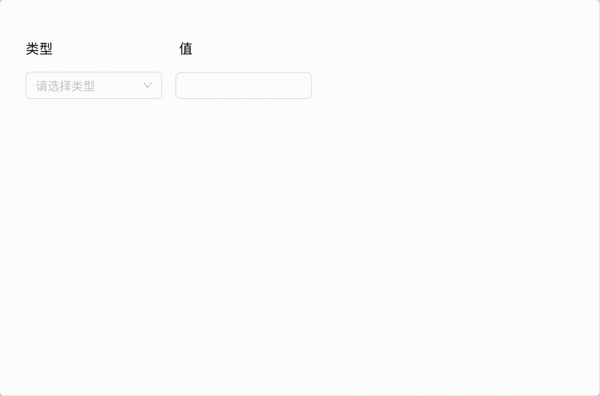

# question

- [question](#question)
  - [1. 表单联动，第二列根据第一列选择，自动更新](#1-表单联动第二列根据第一列选择自动更新)
  - [2. Tab panel 切换，如何减少性能消耗？树的追溯，为什么不能清除根节点？](#2-tab-panel-切换如何减少性能消耗树的追溯为什么不能清除根节点)
    - [2.1. Tab panel 切换，如何减少性能消耗？](#21-tab-panel-切换如何减少性能消耗)
    - [2.2. 树的追溯，为什么不能清除根节点？](#22-树的追溯为什么不能清除根节点)
  - [3. 和产品经理的协同清单，最小化原则](#3-和产品经理的协同清单最小化原则)

## 1. 表单联动，第二列根据第一列选择，自动更新

代码路径：src/App.tsx

项目启动：

```shell
npm i
npm start
```

效果演示：

1、首先维护一个组件类型对应关系

```ts
const TYPE_MAP: Options = {
  input: {
    label: "输入框",
    component: <Input style={formstyle} />,
  },
  inputNumber: {
    label: "数字输入框",
    component: <InputNumber style={formstyle} />,
  },
  select: {
    label: "选择器",
    component: <Select style={formstyle} showSearch />,
  },
  datePicker: {
    label: "日期选择框",
    component: <DatePicker style={formstyle} />,
  },
  switch: {
    label: "开关",
    component: <Switch />,
  },
};
```

2、监听类型选择事件

```tsx
 <Select
  style={formstyle}
  placeholder="请选择类型"
  options={seletOptions}
  onChange={(v) => setType(v)}
/>
```

3、渲染对应的类型组件

```tsx
{TYPE_MAP[type].component}
```

## 2. Tab panel 切换，如何减少性能消耗？树的追溯，为什么不能清除根节点？

### 2.1. Tab panel 切换，如何减少性能消耗？

> 首先问题定位

1. 打开控制台上的Memory面板，录制快照;

2. 选择堆快照类型: Heap snapshot、Allocation instrumentation on timeline;

3. 查看JS堆快照

Summary 总览视图：按构造函数分组。用于捕捉对象及其使用的内存，定位DOM内存泄露。在Class filter文本框中输入Detached可以搜索分离的DOM树。如果分离节点被JS引用，有可能就是泄露点。  

1）Constructor：构造函数，节点下的对象都是由改构造函数创建而来。  
2）Distance：与根节点的距离。  
3）Objects Count：对象个数及百分占比。  
4）Shallow size：对象的直接内存总数，直接内存是指对象自身占用的内存大小。  
5）Retained size：对象的最大保留内存，保留内存是指对象被删除后可以释放的那部分内存。  

4. 查看JS堆分配时间线

通过Allocation instrumentation on timeline可以持续的记录堆分配的情况，显示了对象在什么时候被创建、什么时候存在内存泄漏等。

柱条表示堆中生成的新对象。高度表示这个对象的大小。  
颜色表示这个对象的内存释放情况：蓝色柱表示这个对象在timeline中生成，结束前仍然存在；  
灰色柱表示这个对象在timeline中生成，但结束前已经被回收了。  

重复执行某个动作，如果最后有不少蓝色柱被保留，这些蓝色柱就是潜在的内存泄露问题。需要判断组件是否被销毁，事件是否解绑。  

> 解决思路

1、将已经打开的tab页面缓存起来从而提胜渲染性能。

2、如果不需要 keep alive，每次打开新tab，都彻底销毁隐藏 之前tab 的内容。

3、SPA模式下，tab内容很复杂，可以用iframe 、微前端替代。

### 2.2. 树的追溯，为什么不能清除根节点？

1. 文档完整性：根节点是整个文档的开始，移除它会导致整个文档结构的破坏，浏览器无法解析没有根节点的文档。

2. 浏览器限制：浏览器的JavaScript引擎不允许删除根节点，因为这会破坏文档的结构，影响浏览器的正常工作。

3. DOM操作规则：DOM操作遵循一定的规则，允许删除除了根节点之外的任何节点。这是因为根节点是整个DOM树的基础，删除它会导致整个树的崩溃。

4. 性能影响：删除根节点并重建整个DOM树是一个昂贵的操作，会严重影响页面的性能。

5. 安全考虑：允许删除根节点可能会带来安全风险，因为它可能导致恶意脚本破坏网页的结构。

## 3. 和产品经理的协同清单，最小化原则

1. 角色定义：明确各自的角色和职责，避免职责重叠或遗漏。

2. 明确目标：确保双方对项目的目标和预期结果有清晰的共识。

3. 文档管理：使用统一的文档管理系统，确保信息的一致性和可访问性。

4. 优先级排序：确定工作的优先级，集中精力解决最关键的问题。

5. 反馈机制：建立快速反馈机制，以便及时调整方向。

6. 持续迭代：采用敏捷开发的方法，持续迭代产品，而不是一次性追求完美。

7. 风险管理：识别潜在风险并制定应对策略，以最小化对项目的影响。
